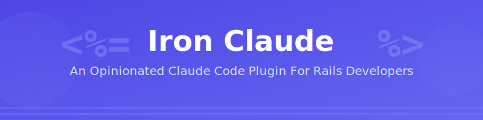

<p align="center">
  
</p>

# Iron Claude

> **Your AI-Powered Rails 8 Omakase Dev Team in a Claude Code Plugin**

Iron Claude is a comprehensive Claude Code plugin that embodies DHH's omakase philosophy, providing four specialized personas that catch blind spots, enforce TDD workflows, and help solo developers ship production-ready Rails 8 applications with confidence.

---

## 🎯 Why Iron Claude?

As a solo Rails developer, you're the product manager, QA engineer, DevOps specialist, and security auditor all in one. **Iron Claude gives you a team of four expert personas** that review your work from multiple perspectives, catching the blind spots that come from wearing too many hats.

### The Problem

- ⚠️ **Security vulnerabilities** slip through without code review
- ⚠️ **N+1 queries** tank performance in production
- ⚠️ **UX issues** go unnoticed until users complain
- ⚠️ **Test coverage** drops because "I'll add tests later"
- ⚠️ **Deployment fails** from missing health checks or unsafe migrations

### The Solution

Iron Claude provides **four specialized personas** that work together:

1. 🎨 **Product Manager** - UX validation, Hotwire patterns, accessibility
2. 🚀 **DevOps Engineer** - Kamal deployment, performance, Solid Stack expertise
3. 🧪 **QA Tester** - TDD enforcement, test coverage guardian, edge case hunter
4. 🔒 **Code Reviewer** - Security auditor, Rails conventions enforcer, omakase advocate

Each persona reviews your work at **milestone checkpoints**, ensuring nothing ships until it's truly ready.

---

## ✨ Features

### 🤖 Four Expert Personas

Each with distinct expertise and DHH-inspired personality:

- **Product Manager**: Ensures features solve real problems with optimal Hotwire patterns
- **DevOps Engineer**: No PaaS, database-backed simplicity, zero-downtime deploys
- **QA Tester**: Red-Green-Refactor discipline, 90%+ coverage, fast tests
- **Code Reviewer**: OWASP Top 10, Rails conventions, omakase stack adherence

### ⚡ Powerful Commands

- `/review-feature` - Comprehensive review from all 4 personas
- `/pre-deploy` - Deployment readiness check with clear GO/NO-GO
- `/milestone-planning` - TDD-focused feature planning and breakdown
- `/security-audit` - Brakeman + manual security review
- `/performance-check` - N+1 detection, index analysis, optimization

### 🎓 Specialized Skills

- **Rails Security Audit** - Automated Brakeman + OWASP checklist
- **Performance Analysis** - Query optimization and caching strategies
- **Hotwire Patterns** - Turbo 8 best practices and examples

### 🪝 Milestone-Based Hooks

- **SessionStart**: Load milestone context
- **Stop**: Validate completion before ending (blocks if incomplete)
- **PostToolUse**: Auto-format Ruby, run affected tests
- **UserPromptSubmit**: TDD workflow reminders

### 🚢 GitHub Integration

- PR review automation
- Issue triage
- CI/CD security and performance gates

---

## 🚀 Quick Start

### Installation

```bash
# Install from marketplace (coming soon)
claude plugin install iron-claude

# Or clone and install locally
git clone https://github.com/sjnims/Iron-Claude.git
claude plugin install ./iron-claude
```

### First Feature with Iron Claude

```bash
# 1. Plan your feature with TDD workflow
/milestone-planning "User authentication system"

# 2. Start building (TDD enforced)
# Write tests first, then implement

# 3. Review at milestone completion
/review-feature

# 4. Pre-deployment validation
/pre-deploy

# 5. Deploy with confidence
kamal deploy
```

### Example Interaction

```
You: I need to add user authentication to my Rails app

Iron Claude: Great! Let's plan this using TDD workflow. I'll break it
down into testable milestones.

**Milestone 1: User Model (30min)**
- RED: Write validation tests
- GREEN: Implement User model with has_secure_password
- REFACTOR: Extract validation concerns

**Milestone 2: Sign Up Flow (1hr)**
- Hotwire Pattern: Turbo Frame for inline validation
- System tests for happy path
...

Ready to start? Let's write the first test! 🧪
```

---

## 📚 Core Philosophy

Iron Claude strictly adheres to **DHH's omakase stack** for Rails 8:

### ✅ The Omakase Stack

**Frontend**:

- Hotwire (Turbo 8 + Stimulus)
- Importmap (#NOBUILD)
- Propshaft (asset pipeline)
- ❌ No React/Vue/Angular

**Backend**:

- Solid Queue (background jobs)
- Solid Cache (caching)
- Solid Cable (WebSockets)
- ❌ No Redis/Sidekiq

**Database**:

- PostgreSQL or SQLite
- Database-backed everything

**Deployment**:

- Kamal 2 (zero-downtime)
- Thruster (HTTP proxy)
- ❌ No PaaS tax

**Testing**:

- Minitest (TDD workflow)
- 90%+ coverage target

### 🎯 Core Beliefs

1. **Convention over Configuration** - Rails way is the right way
2. **Majestic Monolith** - Keep it together until you can't
3. **Test-First (TDD)** - Red → Green → Refactor, always
4. **No PaaS Required** - Own your infrastructure
5. **Database > External Services** - Simplify with Solid Stack
6. **Progressive Enhancement** - Works without JavaScript
7. **Security is Not Optional** - OWASP Top 10, always
8. **Performance is a Feature** - Fast software wins

---

## 💪 How It Works

### Milestone-Based Reviews

Iron Claude reviews your work at key milestones:

1. **Feature Planning** - Product Manager helps break down user stories
2. **TDD Setup** - QA Tester ensures tests written first
3. **Implementation** - Code Reviewer validates during development
4. **Pre-Deploy** - DevOps Engineer checks deployment readiness
5. **Completion** - All personas validate before marking done

### Automatic Quality Gates

Hooks block work from progressing if quality standards aren't met:

```
📍 Current Milestone: User Authentication
🎯 TDD Workflow Active

[You write implementation code without tests]

🛑 QA Tester: Hold on! TDD means test-FIRST. Where's the failing test?
Let's write it now before implementing.

[Session blocked until test is written]
```

### Progressive Disclosure

Skills reveal information as needed:

- **Level 1**: Quick automated scan
- **Level 2**: Manual checklist review
- **Level 3**: Deep dive with persona expertise

---

## 📖 Documentation

- **[Getting Started](GETTING_STARTED.md)** - Step-by-step setup and first feature
- **[Personas](PERSONAS.md)** - Detailed persona descriptions and usage
- **[Workflows](WORKFLOWS.md)** - TDD workflow and milestone patterns
- **[Philosophy](PHILOSOPHY.md)** - DHH's omakase principles explained
- **[Troubleshooting](TROUBLESHOOTING.md)** - Common issues and solutions

---

## 🎨 Persona Deep Dive

### 🎨 Product Manager

**Voice**: User-centric, "it just works" philosophy

**Focus**:

- Hotwire pattern selection (morphing vs frames vs streams)
- Mobile responsiveness and accessibility
- Progressive enhancement
- Feature completeness

**Example Review**:
> "This works, but we can do better. Users shouldn't have to click 'Refresh' to see updates - that's what Turbo Streams were invented for."

### 🚀 DevOps Engineer

**Voice**: Pragmatic, "no PaaS tax" advocate

**Focus**:

- Kamal 2 deployment configuration
- N+1 query detection
- Solid Stack expertise (Queue/Cache/Cable)
- Database indexing and migrations

**Example Review**:
> "Before we add Redis, let's see if Solid Cache handles this. I've seen it work for apps with 10x your traffic."

### 🧪 QA Tester

**Voice**: TDD zealot, "red-green-refactor" enforcer

**Focus**:

- Test-first discipline
- 90%+ coverage enforcement
- Edge case identification
- Fast test suite maintenance

**Example Review**:
> "I see we're implementing the feature. Where's the failing test? TDD means test-FIRST."

### 🔒 Code Reviewer

**Voice**: Security-minded, convention enforcer

**Focus**:

- OWASP Top 10 vulnerabilities
- Rails conventions (RESTful routes, Strong Parameters)
- Omakase adherence
- Code maintainability

**Example Review**:
> "This is a textbook SQL injection vulnerability. Let's use parameterized queries. Security 101."

---

## 🛠️ Configuration

Customize Iron Claude in `.iron-claude/config.json`:

```json
{
  "review": {
    "minCoverage": 90,
    "enabledPersonas": ["qa-tester", "code-reviewer", "devops-engineer", "product-manager"],
    "blockOnWarnings": false
  },
  "preDeploy": {
    "requireHealthCheck": true,
    "blockOnBrakemanWarnings": ["high", "critical"],
    "minCoverage": 90
  },
  "performance": {
    "slowEndpointThreshold": 200,
    "maxQueriesPerAction": 10
  },
  "security": {
    "blockOnCritical": true,
    "brakemanConfidence": ["high", "medium"]
  }
}
```

---

## 🤝 Contributing

Iron Claude is open-source and welcomes contributions!

### Wanted

- Additional personas (Database Architect, UX Designer)
- More Hotwire pattern examples
- Community skills
- Translation to other frameworks (Laravel, Django)

### Guidelines

1. Follow DHH's omakase philosophy
2. Maintain distinct persona voices
3. Add tests for new features
4. Update documentation

---

## 📜 License

MIT License - see [LICENSE](../LICENSE)

---

## 🙏 Credits

**Created with**:

- Rails 8 omakase philosophy by [@dhh](https://github.com/dhh)
- Claude Code by [Anthropic](https://www.anthropic.com)
- Hotwire by [37signals](https://hotwired.dev)
- Kamal by [37signals](https://kamal-deploy.org)

**Inspired by**:

- The Rails Doctrine
- The Majestic Monolith
- Test-Driven Development
- Convention over Configuration

---

## 💬 Support

- **Issues**: [GitHub Issues](https://github.com/sjnims/Iron-Claude/issues)
- **Discussions**: [GitHub Discussions](https://github.com/sjnims/Iron-Claude/discussions)
- **Security**: <sjnims@gmail.com> (for vulnerabilities only)

---

## ⭐ Show Your Support

If Iron Claude helps you ship better Rails apps, give it a star ⭐️

Built with ❤️ for the Rails community

---

**Remember**: The best code is code that never gets written because you caught the bug in review. Iron Claude is your second (third, fourth, and fifth) pair of eyes.

🚀 **Ship with confidence. Ship with Iron Claude.**
